**РОССИЙСКИЙ УНИВЕРСИТЕТ ДРУЖБЫ НАРОДОВ**

**Факультет физико-математических и естественных наук**

**Кафедра прикладной информатики и теории вероятностей**

**ОТЧЕТ**

**по лабораторной работе № [7]{.ul}**

*[дисциплина: Архитектура компьютера]{.ul}*

[Студент: Ибрагимов Магомед]{.ul}

Группа: НПИбд-01-22

**МОСКВА**

2022 г.

**Цель работы:**

Освоение арифметических инструкций языка ассемблера NASM.

**Порядок выполнения лабораторной работы:**

**Символьные и численные данные в NASM.**

Создадим каталог для программ лабораторной работы №7, перейдем в него и
создадим файл lab7-1.asm (рис. 1).

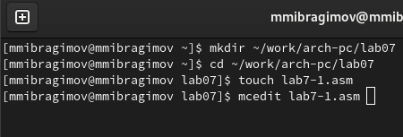{width="4.497222222222222in"
height="1.5291666666666666in"}

Рис. 1. Создание каталога и файла

Затем рассмотрим примеры программ вывода символьных и численных
значений. Программы будут выводить значения, записанные в регистр eax.

Введем в файл lab7-1.asm текст программы (рис. 2). В данной программе в
регистр eax записывается символ 6 (mov eax,\'6\'), в регистр ebx символ
4 (mov ebx,\'4\'). Далее к значению в регистре eax прибавляем значение
регистра ebx (add eax,ebx, результат сложения запишется в регистр eax).
Далее выводим результат. Так как для работы функции sprintLF в регистр
eax должен быть записан адрес, необходимо использовать дополнительную
переменную. Для этого запишем значение регистра eax в переменную buf1
(mov \[buf1\],eax), а затем запишем адрес переменной buf1 в регистр eax
(mov eax,buf1) и вызовем функцию sprintLF.

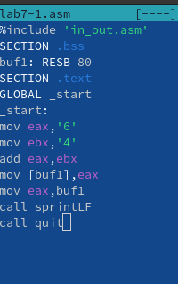{width="1.9159722222222222in"
height="3.0458333333333334in"}

Рис. 2. Код программы lab7-1

Затем создадим исполняемый файл и запустим его (рис. 3).

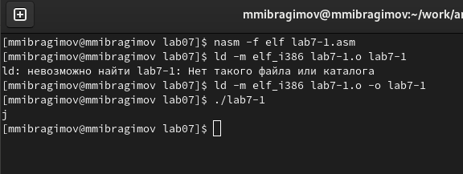{width="6.278472222222222in"
height="2.2604166666666665in"}Рис. 3. Результат работы программы

В данном случае при выводе значения регистра eax мы ожидаем увидеть
число 10. Однако результатом будет символ j. Это происходит потому, что
код символа 6 равен 00110110 в двоичном представлении (или 54 в
десятичном представлении), а код символа 4 -- 00110100 (52). Команда add
eax,ebx запишет в регистр eax сумму кодов -- 01101010 (106), что в свою
очередь является кодом символа j (см. таблицу ASCII).

Далее изменим текст программы и вместо символов, запишем в регистры
числа (рис. 4).

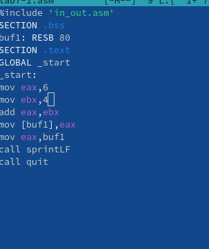{width="3.15625in"
height="3.7604166666666665in"}

Рис. 4. Исправленный код программы lab7-1

Создадим исполняемый файл и запустим его (рис. 5).

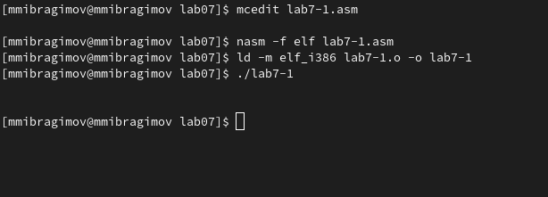{width="6.395833333333333in"
height="2.3020833333333335in"}

Рис. 5. Результат работы программы

Как и в предыдущем случае при исполнении программы мы не получим число
10, в данном случае выводится символ с кодом 10, этому коду
соответствует управляющий символ перевода строки.

Для работы с числами в файле in_out.asm реализованы подпрограммы для
преобразования ASCII символов в числа и обратно. Преобразуем текст
программы с использованием этих функций. Создадим файл lab7-2.asm и
введем в него следующий текст (рис. 6).

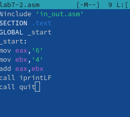{width="2.6770833333333335in"
height="2.40625in"}

Рис. 6. Код программы lab7-2

Создадим исполняемый файл и запустим его (рис. 7).

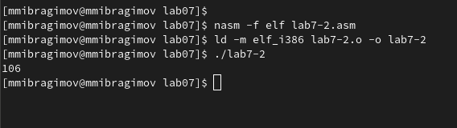{width="6.476388888888889in"
height="1.6666666666666667in"}Рис. 7. Результат работы программы

В результате работы программы мы получим число 106. В данном случае, как
и в первом, команда add складывает коды символов '6' и '4' (54+52=106).
Однако, в отличии от программы из листинга 7.1, функция iprintLF
позволяет вывести число, а не символ, кодом которого является это число.

Аналогично предыдущему примеру изменим символы на числа (рис. 8).

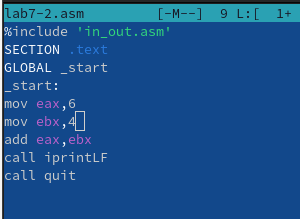{width="3.125in"
height="2.28125in"}

Рис. 8. Изменение кода программы lab7-2

В итоге при выполнении программы получился следующий результат (рис. 9).

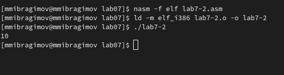{width="6.186111111111111in"
height="1.5520833333333333in"}Рис. 9. Результат работы программы lab7-2

Заменим функцию iprintLF из рис. 8 на iprint (рис. 10).

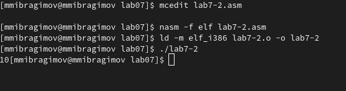{width="6.2625in"
height="1.5625in"}Рис. 10. Результат работы программы с iprint

Как видим, отличие команды iprint от iprintLF заключается в том, что
команда iprint не переводит строку.

**Выполнение арифметических операций в NASM.**

В качестве примера выполнения арифметических операций в NASM приведем
программу вычисления арифметического выражения 𝑓(𝑥) = (5 ∗ 2 + 3)/3.

Создадим файл lab7-3.asm в каталоге \~/work/arch-pc/lab07 и введем в
него следующий текст (рис. 11).

{width="4.708333333333333in"
height="5.625in"}

Рис. 11. Код программы lab7-3

Создадим исполняемый файл и запустим программу (рис. 12).

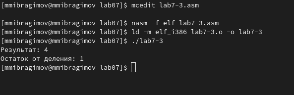{width="6.177083333333333in"
height="2.0in"}

Рис. 12. Результат работы программы lab7-3

Изменим текст программы для вычисления выражения 𝑓(𝑥) = (4 ∗ 6 + 2)/5
(рис. 13). Затем создадим файл и проверим его работу (рис. 14).

{width="4.854166666666667in"
height="4.135416666666667in"}

Рис. 13. Код новой программы lab7-3

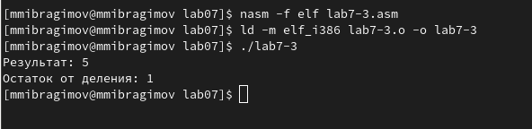{width="6.166666666666667in"
height="1.5in"}Рис. 14. Результат работы программы lab7-3

В качестве другого примера рассмотрим программу вычисления варианта
задания по номеру студенческого билета, работающую по следующему
алгоритму:

• вывести запрос на введение № студенческого билета

• вычислить номер варианта по формуле: (𝑆𝑛 mod 20) + 1, где 𝑆𝑛 -- номер
студенческого билета (В данном случае 𝑎 mod 𝑏 -- это остаток от деления
𝑎 на 𝑏).

• вывести на экран номер варианта.

В данном случае число, над которым необходимо проводить арифметические
операции, вводится с клавиатуры. Как отмечалось выше ввод с клавиатуры
осуществляется в символьном виде и для корректной работы арифметических
операций в NASM символы необходимо преобразовать в числа. Для этого
использetv функция atoi из файла in_out.asm.

Создадим файл variant.asm в каталоге \~/work/arch-pc/lab07 и напишем в
нем код программы (рис. 15).

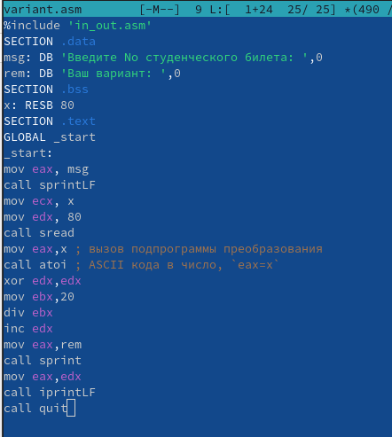{width="4.604166666666667in"
height="5.135416666666667in"}

Рис. 15. Код программы variant

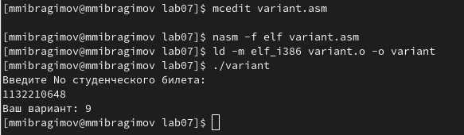{width="6.072916666666667in"
height="1.7708333333333333in"}

Рис. 16. Результат работы программы variant

Как видим, мой вариант для следующего задания №15.

Ответы на вопросы:

1.  За вывод на экран сообщения 'Ваш вариант: ' отвечают следующие
    строки:

rem: DB \'Ваш вариант: \',0

> mov eax,rem

call sprint

2.  Инструкция nasm используется для преобразования текста программы в
    объектный код; инструкция mov ecx,x используется для записи адреса
    под вводимую строку; инструкция mov edx, 80 используется для
    определения длины вводимой строки; инструкция call sread
    используется для ввода сообщения с клавиатуры.

3.  Инструкция call atoi используется для приобразования ascii-кода
    символа в целое число и записывает результат в регистр eax.

4.  За вычисление варианта отвечают следующие строки кода:

mov eax,x

call atoi

xor edx,edx

mov ebx,20

div ebx

inc edx

5.  Остаток от деления при выполнении инструкции div ebx записывается в
    регистр edx.

6.  Инструкция inc edx используется для увеличения значения регистра edx
    на 1.

7.  За вывод на экран результата вычислений отвечают следующие строки
    кода:

mov eax,edx

call iprintLF

**Порядок выполнения самостоятельной работы:**

Напишем программу вычисления выражения, в соответствии с вариантом,
полученным в предыдущем задании - вариант № 9 (рис. 17).

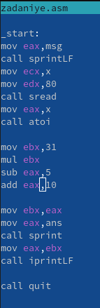{width="1.7951388888888888in"
height="5.511805555555555in"}

Рис. 17. Код программы zadaniye

Затем создадим исполняемый файл, запустим программу и проверим его для
значений x~1~ = 3; x~2~ = 1 (рис. 18).

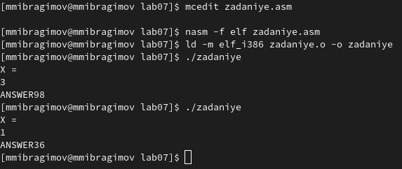{width="5.96875in"
height="2.5208333333333335in"}

Рис. 18. Результат работы программы zadaniye

**Выводы:**

Во время выполнения лабораторной работы были освоены арифметические
инструкции языка ассемблера NASM: add -- сложение, sub -- вычитание, mul
-- умножение, div -- деление нацело, inc -- увеличение на 1, dec --
уменьшение на 1, neg -- изменение знака числа.
